# Self-Driving Car Engineer Nanodegree Project: Advanced Lane Finding Project
by Xueyi Zou email:xy.zou@outlook.com

## Overview

The goals / steps of this project are the following:

* Compute the camera calibration matrix and distortion coefficients given a set of chessboard images.
* Apply a distortion correction to raw images.
* Use color transforms, gradients, etc., to create a thresholded binary image.
* Apply a perspective transform to rectify binary image ("birds-eye view").
* Detect lane pixels and fit to find the lane boundary.
* Determine the curvature of the lane and vehicle position with respect to center.
* Warp the detected lane boundaries back onto the original image.
* Output visual display of the lane boundaries and numerical estimation of lane curvature and vehicle position.

## Dependencies

This project requires **Python 3.5** and the following Python libraries installed:
- [NumPy](http://www.numpy.org/)
- [Matplotlib](http://matplotlib.org/)
- [OpenCV](http://opencv.org/)
- [Moviepy](http://zulko.github.io/moviepy/)

## Folders and Files
- `camera_cal`: Folder to hold images for camera calibration.

- `test_images`: Folder to hold test images.

- `output_images`: Folder to hold examples of the output from each stage of the image processing pipeline. It also contains the video output.

- `code.py`: the python code for this project.

- `project_video.mp4`: the video used to test the lane-line finding pipeline.

- `challenge_video.mp4`: (optional) a challenging video used to test the lane-line finding pipeline.

- `harder_challenge_video.mp4`: (optional) a even more challenging video used to test the lane-line finding pipeline.

- `README.md`: the requirements of this project.

- `writeup.md`: (this file) explains the lane-line finding pipeline.

- `LICENSE`: GNU GENERAL PUBLIC LICENSE file.


## [Rubric](https://review.udacity.com/#!/rubrics/571/view) Points
Here I will consider the rubric points individually and describe how I addressed each point in my implementation.  

### Writeup / README

#### 1. Provide a Writeup / README that includes all the rubric points and how you addressed each one.  You can submit your writeup as markdown or pdf.  [Here](https://github.com/udacity/CarND-Advanced-Lane-Lines/blob/master/writeup_template.md) is a template writeup for this project you can use as a guide and a starting point.  

You're reading it!
### Camera Calibration

#### 1. Briefly state how you computed the camera matrix and distortion coefficients. Provide an example of a distortion corrected calibration image.

The code for this step is contained in the python function `get_mtx_dist()` located in code cell 1 of `code.py`.  

I start by preparing "object points", which will be the (x, y, z) coordinates of the chessboard corners in the world. Here I am assuming the chessboard is fixed on the (x, y) plane at z=0, such that the object points are the same for each calibration image.  Thus, `objp` is just a replicated array of coordinates, and `objpoints` will be appended with a copy of it every time I successfully detect all chessboard corners in a test image.  `imgpoints` will be appended with the (x, y) pixel position of each of the corners in the image plane with each successful chessboard detection.  

I then used the output `objpoints` and `imgpoints` to compute the camera calibration and distortion coefficients using the `cv2.calibrateCamera()` function.  I applied this distortion correction to a test image (i.e. `./test_images/straight_lines1.jpg`) using the `cv2.undistort()` function and obtained this result:

Original image | Undistorted image         
----|-------
 | 

---

### Pipeline (single images)

The code for this part is located in code cell 3 of `code.py`, however, it uses helper function defined in code cell 1.

#### 1. Provide an example of a distortion-corrected image.
To demonstrate this step, I will describe how I apply the distortion correction to one of the test images (i.e. `./test_images/straight_lines1.jpg`):

Original image | Undistorted image         
----|-------
 | 

#### 2. Describe how (and identify where in your code) you used color transforms, gradients or other methods to create a thresholded binary image.  Provide an example of a binary image result.
The code for this step is defined in the `get_color_combo_binary(img,sx_thresh=(20, 100), s_thresh=(170, 255),  showGUI=False)` function located in code cell 1.

I used a combination of color (in HLS space) and gradient thresholds to generate a binary image. I also used a `region_of_interest(img, vertices)` function (also located in code cell 1) to get a masked binary image. Here's an example of my output for this step used to `./test_images/straight_lines1.jpg`, which has already been shown above.

color binary | combined binary  | masked combined binary       
----|-------|-------
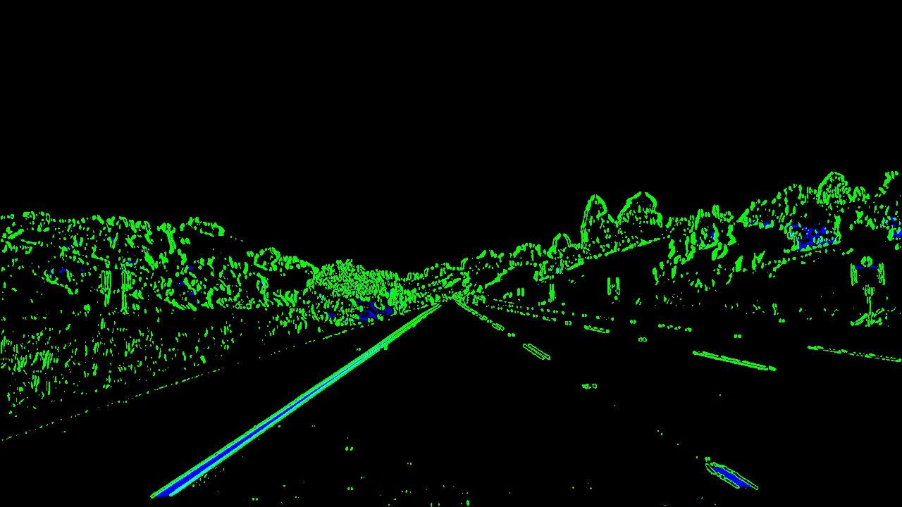 | 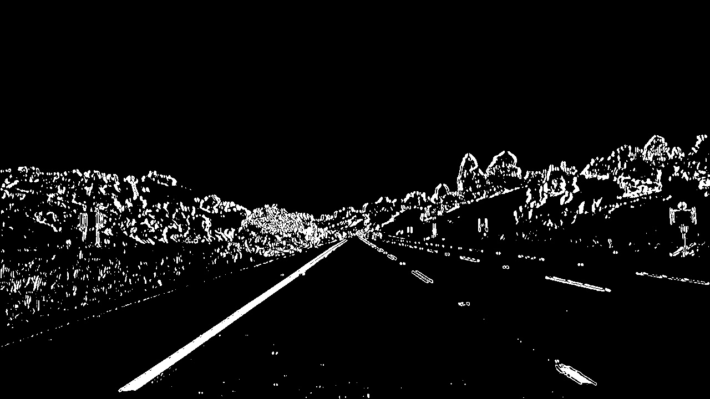 | 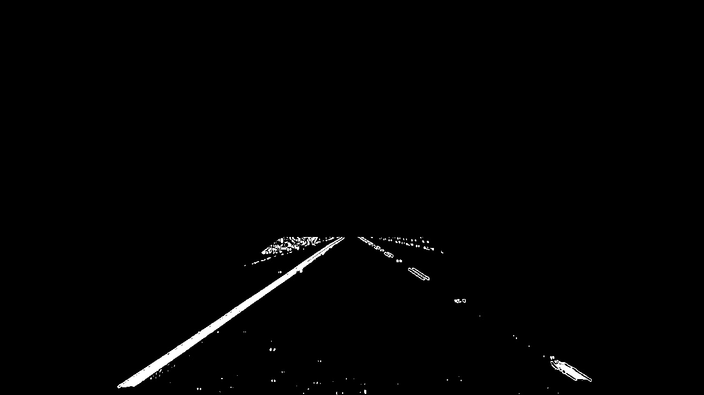

#### 3. Describe how (and identify where in your code) you performed a perspective transform and provide an example of a transformed image.

The code for my perspective transform includes a function called `get_persp_trans_mtx(img_undist, showGUI=False)` and a function called `do_persp_tf(img, M, showGUI=False)`, which appear in code cell 1 of the file `code.py`.  

The `get_persp_trans_mtx(img_undist, showGUI=False)` function takes as inputs an (undistorted) image `img_undist`, and returns a perspective transformation matrix `M` and its inverse `Minv`.  

I chose the hardcode the source and destination points in the following manner:

```
img_size= (img_undist.shape[1],img_undist.shape[0])
src = np.float32(
[[(img_size[0] / 2) - 55, img_size[1] / 2 + 100],
[((img_size[0] / 6) - 10), img_size[1]],
[(img_size[0] * 5 / 6) + 40, img_size[1]],
[(img_size[0] / 2 + 55), img_size[1] / 2 + 100]])

dst = np.float32(
[[(img_size[0] / 4), 0],
[(img_size[0] / 4), img_size[1]],
[(img_size[0] * 3 / 4), img_size[1]],
[(img_size[0] * 3 / 4), 0]])

```
This resulted in the following source and destination points:

| src        | dst   |
|:-------------:|:-------------:|
| 585, 460      | 320, 0        |
| 203, 720      | 320, 720      |
| 1106.7, 720     | 960, 720      |
| 695, 460      | 960, 0        |

And I then used the following code to get `M` and `Minv`:

```
M = cv2.getPerspectiveTransform(src, dst)
Minv = cv2.getPerspectiveTransform(dst, src)
```
For the `do_persp_tf(img, M, showGUI=False)` function, I simply used OpenCV function `cv2.warpPerspective(img, M, (img.shape[1], img.shape[0]))`.

I verified that my perspective transform was working as expected by drawing the `src` and `dst` points onto a test image (i.e. `./test_images/straight_lines1.jpg`) and its warped counterpart to verify that the lines appear parallel in the warped image.

src image | dst image         
----|-------
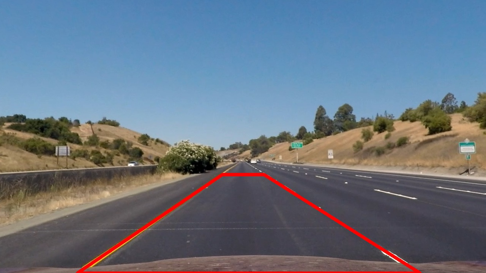 | 

Applying the perspective transform to the binary image results the following:

binary | perspective transformed binary        
----|-------
 | 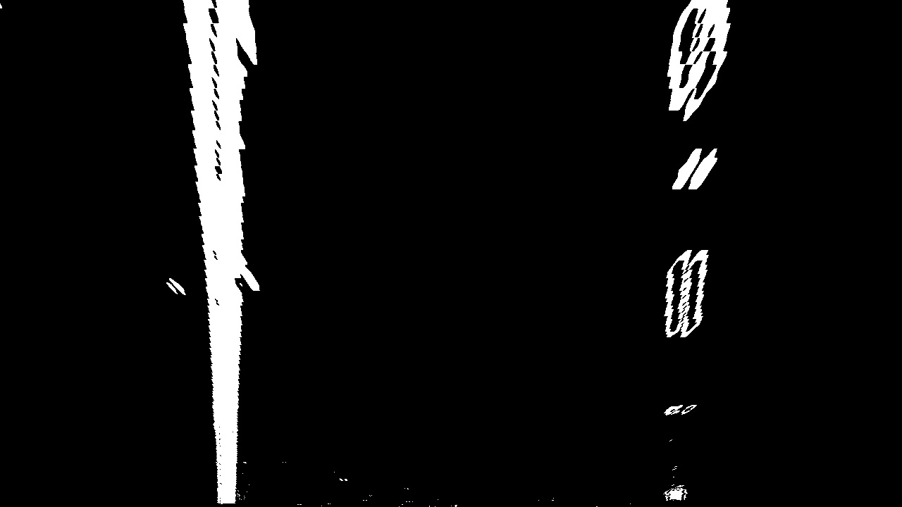

#### 4. Describe how (and identify where in your code) you identified lane-line pixels and fit their positions with a polynomial?

The code for finding lane-line pixels and fitting their positions with a polynomial includes a function called `find_left_right_line_points(warped_binary)`, a function called `do_poly_fit(leftx,lefty,rightx,righty, warped_binary=None)`, and a function called `find_left_right_line_points_again(warped_binary, left_fit, right_fit)`, all appear in code cell 1 of the file `code.py`.

`find_left_right_line_points(warped_binary)` is used to find left and right lane-line pixels at the beginning of the pipeline. It takes as input a warped binary image called "warped_binary" and then makes a histogram of the bottom half of the image. By finding the peak of the left and right halves of the histogram, it creates the starting point for the left and right lines. It then uses sliding windows to find more pixels that belong to the left and the right lane-lines.

After finding the  left and right lane-line pixels, `do_poly_fit(leftx,lefty,rightx,righty, warped_binary=None)` was used to fit two second order polynomials to them. The following code was used to achieve this:
```
left_fit = np.polyfit(lefty, leftx, 2)
right_fit = np.polyfit(righty, rightx, 2)
```

Once we know where the lines are, in the next frame of video we don't need to do a blind search again, but instead we can just search in a margin around the previous
line position. The function `find_left_right_line_points_again(warped_binary, left_fit, right_fit)` was used to achieve this.

Following is the effect of applying this step to the perspective transformed binary image (i.e. `./output_images/straight_lines1_combined_binary_masked_warped.jpg`)

perspective transformed binary | fitted perspective transformed binary        
----|-------
 | 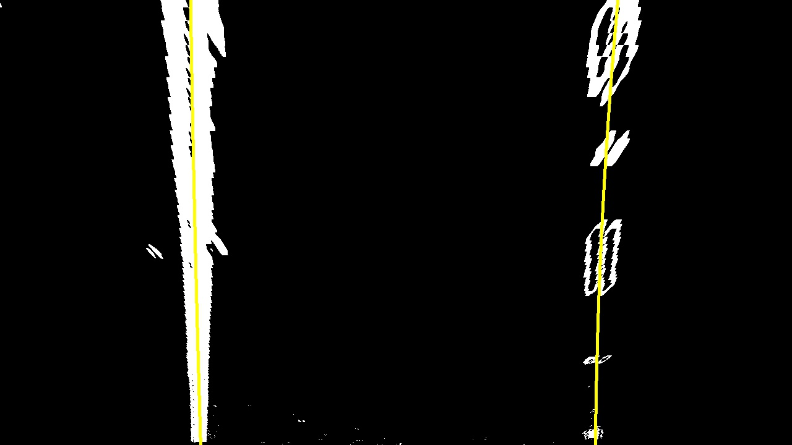

#### 5. Describe how (and identify where in your code) you calculated the radius of curvature of the lane and the position of the vehicle with respect to center.

The code for this step is the function `calculate_curvature_offset(warped_binary,left_fit,right_fit)` located in code cell 1 of `code.py`.

The method to calculate curvatures is based on the method provided in the [course page](https://classroom.udacity.com/nanodegrees/nd013/parts/fbf77062-5703-404e-b60c-95b78b2f3f9e/modules/2b62a1c3-e151-4a0e-b6b6-e424fa46ceab/lessons/40ec78ee-fb7c-4b53-94a8-028c5c60b858/concepts/2f928913-21f6-4611-9055-01744acc344f).

To calculate offset, we assume the camera is mounted at the center of the car, such that the lane center is the midpoint at the bottom of the image between the two lines we've detected. The offset of the lane center from the center of the image (converted from pixels to meters) is the distance from the center of the lane.

The conversions in x and y from pixels space to meters I used is defined as follows:
```
  ym_per_pix = 3/72 # meters per pixel in y dimension
  xm_per_pix = 3.7/640 # meters per pixel in x dimension
```
This is because in the perspective transformed images:
- a dashed lane line is about 72 pixels long, but in reality, it is about 3 meters long.

- the road is about 640 pixels wide, but in reality, it is 3.7 meters wide.

#### 6. Provide an example image of your result plotted back down onto the road such that the lane area is identified clearly.

The code for this step is in the function `warp_back(undist,left_fit,right_fit, Minv, print_string,showGUI=False)` located in code cell 1 of `code.py`.

Here is an example of my result on a test (i.e. `test_images/straight_lines1.jpg`) image:

original image | warped back image       
----|-------
 | 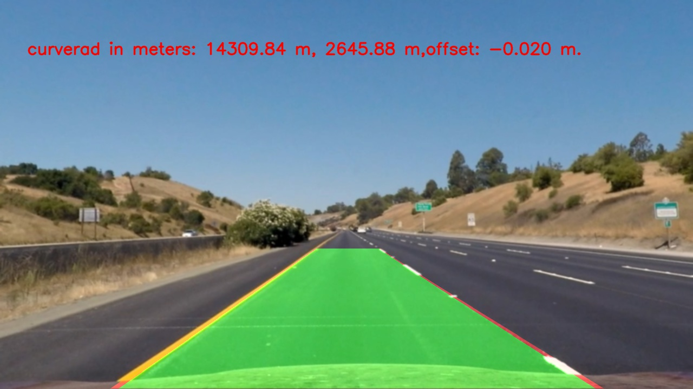


Here is more examples of using the pipeline the some test images:

original image | result       
----|-------
|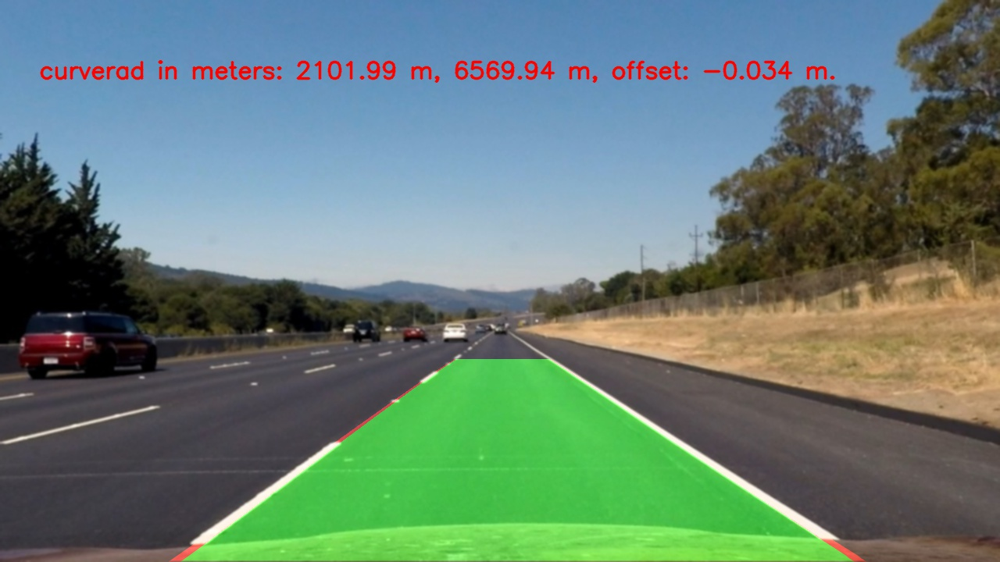
 |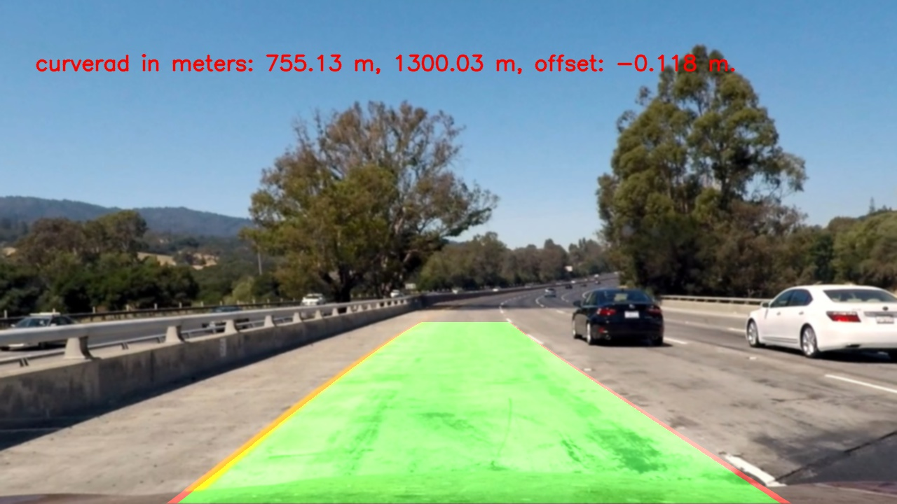
 |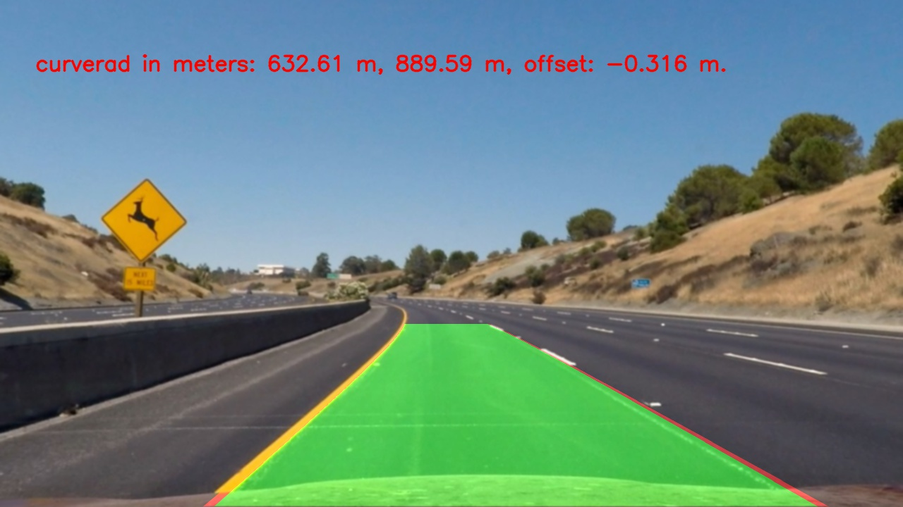
 |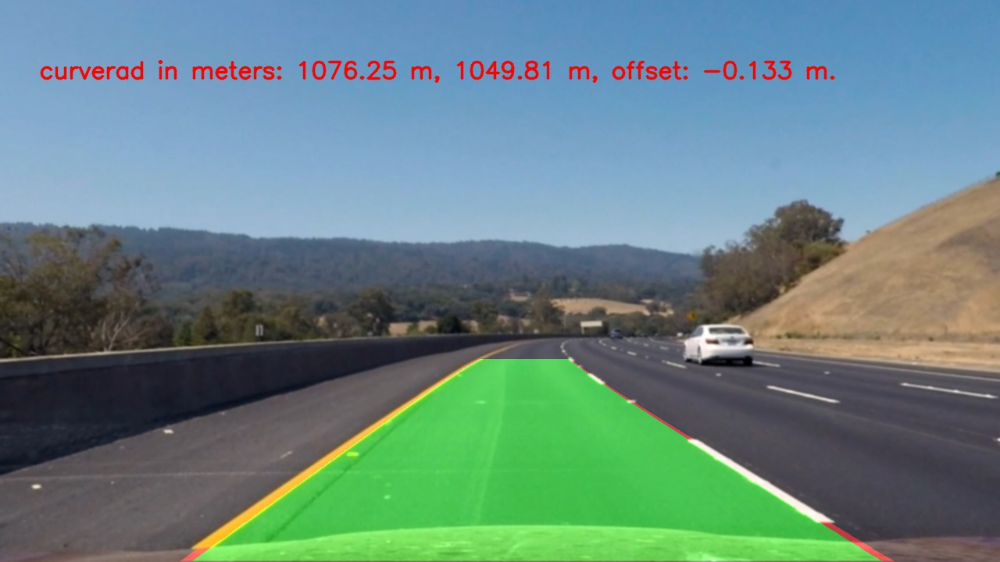
 |
 |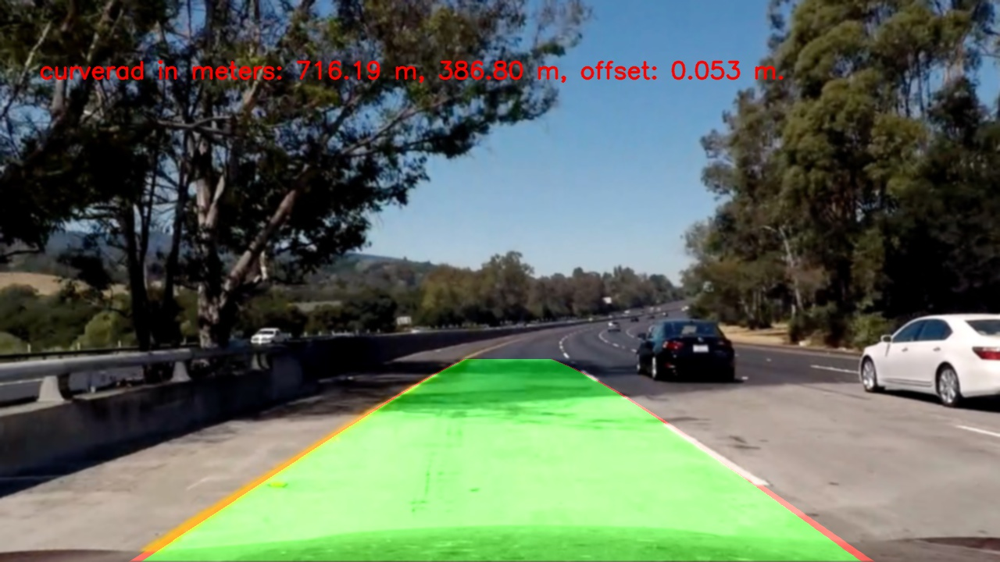
 |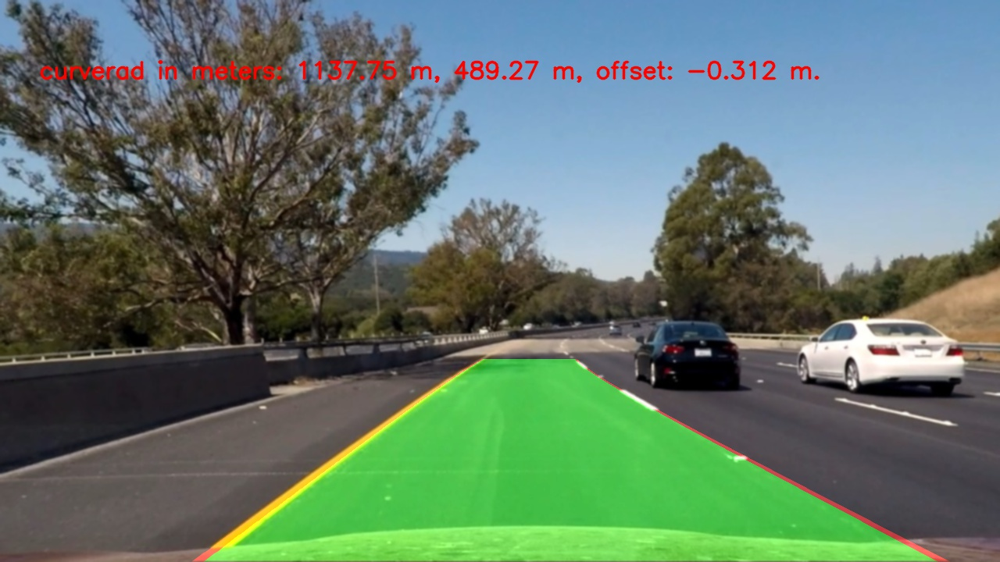

Note that in some images (e.g. the 6th row), the effects of lane-lines finding are not very good. This is because we did not use information provided by previous images, and did not use the function `find_left_right_line_points_again(warped_binary, left_fit, right_fit)`. In the following, we will use this pipeline to video images, where we can use previous information.

---
### Pipeline (video)

#### 1. Provide a link to your final video output.  Your pipeline should perform reasonably well on the entire project video (wobbly lines are ok but no catastrophic failures that would cause the car to drive off the road!).

I defined a `image_process_pipeline(mtx, dist,M,Minv)` in code cell 1 of `code.py`to process images in a video, which is as follows:

```
def image_process_pipeline(mtx, dist,M,Minv):
    fit_info=[]
    def process(image):
        # NOTE: The output you return should be a color image (3 channel) for processing video below
        img_undist = do_undistort(image, mtx, dist, showGUI=False)
        img_undist= gaussian_blur(img_undist, 5)
        color_binary, combined_binary, combined_binary_masked=get_color_combo_binary(img_undist, sx_thresh=(20, 100),s_thresh=(150, 255),  showGUI=False)
        warped_binary =do_persp_tf(combined_binary_masked,M, showGUI=False)

        if not fit_info:
            leftx,lefty,rightx,righty=find_left_right_line_points(warped_binary)
            left_fit,right_fit=do_poly_fit(leftx,lefty,rightx,righty)
        else:
            leftx,lefty,rightx,righty=find_left_right_line_points_again(warped_binary, fit_info[-1][0], fit_info[-1][1])
            left_fit,right_fit=do_poly_fit(leftx,lefty,rightx,righty)
            #weights=[1,1,1,1,1]
            weights=[0.4,0.5,0.6,0.8,0.9]
            for idx,fit in enumerate(fit_info):
                left_fit +=weights[idx]*fit[0]
                right_fit +=weights[idx]*fit[1]

            left_fit /= (1+sum(weights[0:len(fit_info)]))
            right_fit /= (1+sum(weights[0:len(fit_info)]))

        fit_info.append((left_fit,right_fit))
        if len(fit_info)>5:
            del fit_info[0]
        assert len(fit_info)<=5

        left_curverad, right_curverad, offset=calculate_curvature_offset(warped_binary,left_fit,right_fit)
        print_string = "curverad in meters: %.2f m, offset: %.3f m." % (0.5*(left_curverad+right_curverad), offset)
        result=warp_back(img_undist,left_fit,right_fit, Minv, print_string, showGUI=False)
        return result

    return process
```
Note that here I defined a list `fit_info` to keep previous 5 poly-fits, and used a **weighted average** to calculate the new poly-fit.

The code for video processing is located in code cell 5 of `code.py`, which makes use of `Moviepy`

Here's a [link to my video result](./output_images/video_output.mp4)

When applied to `project_video.mp4`, the result is OK. However, it failed to get good results for the two challenging videos.

---

### Discussion

#### 1. Briefly discuss any problems / issues you faced in your implementation of this project.  Where will your pipeline likely fail?  What could you do to make it more robust?

**Problems / Issues**

The first problem I faced is how to define the source points and destination points to get the perspective transformation matrix. I first tried visually selecting four points which should form a rectangle in a road image, but due to that the selection is not very accurate, the results of the transformation is always not satisfactory. I then turn to hard-code the source points and then fine-tune them, and I got a satisfactory perspective transformation matrix to some extent.

The second problem is about noise in the binary images, which cause the poly-fit to be not very good. The solution I used is to use `Region of Interest` to mask out the noise.

The third problem is how to make the lane-line finding robust and constant. I still can not find a very good solution,but using an weighted average can generate some good results for `project_video.mp3`.

**Where will your pipeline likely fail?**

The pipeline will likely fail in roads that are not flat, because the perspective transformation was confined to flat situations.  

The pipeline will likely fail in situations where there are frequent light changes, because the thresholds used to create binary images were fixed.

**What could you do to make it more robust?**

This project is difficult for me, I have spent a lot of efforts so far. Maybe try the following:

- Better use of history information
- Checking that the detected lane-lines are roughly parallel, else use old detections
- Method for recovering from loosing track of lane-lines
